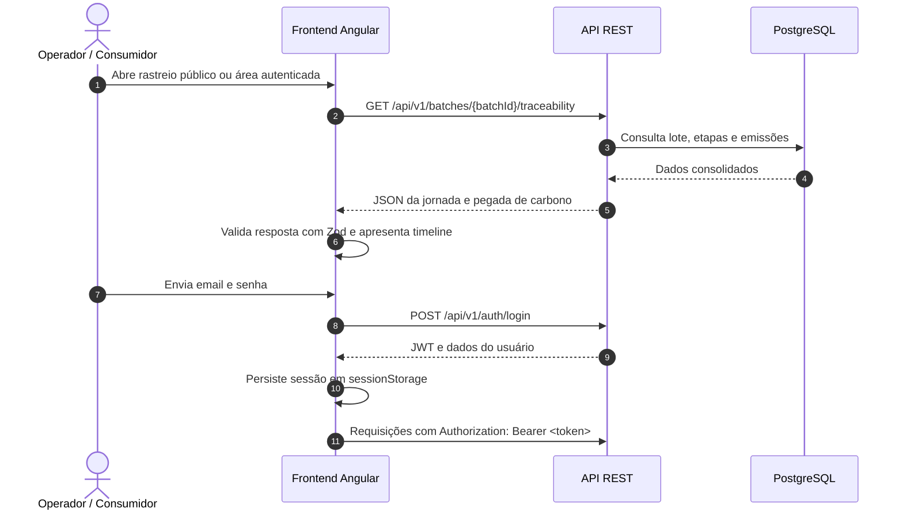
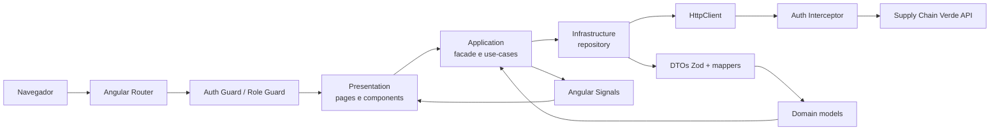

# 🌱 Supply Chain Verde — Frontend de Rastreabilidade & Sustentabilidade


> Rastreabilidade pública de lotes, gestão de fornecedores e acompanhamento da sustentabilidade da cadeia de suprimentos.

O **Supply Chain Verde Web** é uma Single Page Application desenvolvida em Angular que consome a [API Supply Chain Verde](https://github.com/matheusnascimentods/supply-chain-verde-api). A interface conecta consumidores, fornecedores, gestores, auditores e administradores aos fluxos de rastreabilidade e sustentabilidade do sistema.



---

## ✨ O Problema

Informações sobre origem, transporte, certificações e emissões costumam ficar espalhadas entre sistemas e documentos. Isso dificulta acompanhar a trajetória de um produto, comparar fornecedores e apresentar dados de sustentabilidade de forma acessível ao consumidor.

## 🚀 A Solução

O frontend oferece uma interface integrada à API para acompanhar lotes da produção ao varejo e operar os principais recursos da cadeia:

- **Rastreabilidade pública:** consulta de lote sem autenticação, incluindo etapas, transporte e pegada de carbono.
- **Visão operacional:** dashboard com indicadores e lotes recentes fornecidos pela API.
- **Gestão de fornecedores:** busca, ranking, certificações e relatórios no contexto de cada fornecedor.
- **Gestão da cadeia:** criação de lotes em fluxo multi-step com seleção/cadastro inline de produto e fornecedor, timelines de etapas, dados de transporte e emissões.
- **Governança:** gestão de usuários e consulta de auditoria com exportação CSV.

## 🎯 Diferenciais

- **Consulta acessível ao consumidor:** página pública de rastreabilidade, acessível pela rota `/rastreio/:batchId`.
- **Dados validados na entrada:** schemas Zod verificam respostas da API antes de atualizarem as telas.
- **Experiência por perfil:** guards e navegação apresentam as áreas adequadas a cada papel; a API valida as permissões efetivas.
- **Informação contextual:** certificações e relatórios são consultados em modais associados ao fornecedor; o ranking integra a própria listagem.
- **Auditoria compreensível:** eventos e snapshots retornados pela API são formatados para leitura humana na interface e no CSV.
- **Interface responsiva:** navegação superior compartilhada, modais e cards adaptáveis a diferentes larguras.

## 🛠️ Stack Tecnológica


| Camada | Tecnologia |
|---|---|
| Framework | Angular 21 (standalone components e router) |
| Linguagem | TypeScript 5.9 |
| Estilos | Tailwind CSS 4 |
| Formulários | Angular Reactive Forms |
| Contratos e validação | Zod 4 |
| HTTP | Angular `HttpClient` e interceptor funcional |
| Estado | Angular Signals em facades por feature |
| Testes unitários | Vitest |
| Testes ponta a ponta | Cypress |

## 🏛️ Arquitetura (core / shared / features em camadas)

A aplicação é organizada em três níveis:

- **`core`**: autenticação (sessão, guards, interceptor e usuário logado), integrações externas (ViaCEP) e layout (shell, navegação por perfil e footer). Não importa features.
- **`shared`**: UI genérica, diretivas e utilitários de formatação. Não importa `core` nem features.
- **`features`**: cada domínio dividido em `domain` (models, regras e value-objects), `application` (facade com signals e use-cases), `infrastructure` (repository HTTP, DTOs Zod e mappers) e `presentation` (páginas e componentes). O `index.ts` é a API pública da feature, e outras features só importam por ele.

O roteador carrega as features sob demanda pelo `index.routes.ts` de cada uma.



### Status de Implementação

- **Funcionalidades principais concluídas:** autenticação, dashboard, rastreabilidade pública, gestão de fornecedores, seleção/cadastro inline de produtos durante a criação de lotes, lotes/etapas, usuários, certificações, relatórios e auditoria.
- **Interface atual:** navegação superior responsiva, footer compartilhado, cards de lotes com timeline e modais contextuais.
- **Qualidade automatizada:** specs unitários, cenários Cypress e CI para testes, build, auditoria de dependências e lint.
- **Validação manual pendente:** navegação com contas de cada papel requer API e credenciais de demonstração disponíveis.
- **Criação de lotes:** modal multi-step com busca paginada de produtos e fornecedores, cadastro inline conforme permissões, revisão e criação sequencial via API.

### Principais Áreas da Aplicação

- **`auth`**: login e integração com a sessão.
- **`dashboard`**: indicadores globais e lotes recentes.
- **`traceability`**: consulta pública e gráficos da pegada de carbono.
- **`suppliers`**: fornecedores, ranking, relatórios e modais de certificações/relatórios.
- **`certifications`**: domínio e formulário de certificações usados pelos fornecedores.
- **`batches`**: lotes, produtos, fluxo multi-step de criação, etapas, transporte e emissões.
- **`users` e `audit-log`**: gestão de usuários e consulta de eventos.

## 📁 Estrutura do Projeto

```text
src/
├── app/
│   ├── core/
│   │   ├── auth/                # sessão, usuário logado, guards e interceptor
│   │   ├── integrations/        # ViaCEP
│   │   └── layout/              # shell, top-nav, footer e navegação por perfil
│   ├── shared/
│   │   ├── ui/                  # button, modal, data-table, pagination, spinner, toast...
│   │   ├── directives/          # close-on-outside-click
│   │   └── utils/               # formatação (CNPJ, telefone, CEP, número pt-BR)
│   └── features/                # cada uma com domain/ application/ infrastructure/ presentation/
│       ├── auth/                # autenticação
│       ├── dashboard/           # indicadores e lotes recentes
│       ├── traceability/        # rastreabilidade pública
│       ├── suppliers/           # fornecedores, ranking e relatórios
│       ├── certifications/      # certificações dos fornecedores
│       ├── batches/             # lotes, produtos, etapas, transporte e emissão
│       ├── users/               # gestão de usuários
│       └── audit-log/           # auditoria e exportação CSV
└── environments/                # URL da API por ambiente

cypress/e2e/                     # fluxos ponta a ponta
docs/
├── initial/                     # SDD inicial: spec, plan e tasks
└── folder-restructure/          # SDD da reestruturação em camadas
```

## 📚 Documentação do Projeto

| Documento | Conteúdo |
|---|---|
| [`docs/initial/spec.md`](docs/initial/spec.md) | Funcionalidades, perfis, rotas e fluxos atuais |
| [`docs/initial/plan.md`](docs/initial/plan.md) | Arquitetura técnica, decisões e fluxo de criação de lote |
| [`docs/initial/tasks.md`](docs/initial/tasks.md) | Histórico de implementação e pendências |
| [`docs/folder-restructure/spec.md`](docs/folder-restructure/spec.md) | Problema, requisitos e critérios de aceite da reestruturação em camadas |
| [`docs/folder-restructure/plan.md`](docs/folder-restructure/plan.md) | Estrutura alvo, padrão por feature e decisões |
| [`docs/folder-restructure/tasks.md`](docs/folder-restructure/tasks.md) | Tarefas e PRs da reestruturação (#41–#53) |

### Pipeline de Qualidade

O workflow de GitHub Actions roda em pull requests e em pushes para `main`:

- instalação reproduzível com `npm ci`;
- testes unitários;
- build de produção;
- auditoria de dependências (`npm audit`);
- análise estática com ESLint.

## ⚡ Quick Start (Frontend + API)

### Pré-requisitos

- [Node.js 22](https://nodejs.org/) e npm 10 ou superior;
- API Supply Chain Verde em execução localmente;
- PostgreSQL configurado para a API (veja o [Quick Start do backend](https://github.com/matheusnascimentods/supply-chain-verde-api#-quick-start-com-docker-compose)).

### 1. Clonar o repositório

```bash
git clone https://github.com/matheusnascimentods/supply-chain-verde-web.git
cd supply-chain-verde-web
```

### 2. Iniciar a API

Siga as instruções de execução e configuração no [README da API](https://github.com/matheusnascimentods/supply-chain-verde-api#-quick-start-com-docker-compose). Por padrão, o frontend espera a API em `http://localhost:8080/api/v1`.

### 3. Instalar dependências e executar o frontend

```bash
npm ci
npm start
```

A aplicação ficará disponível em **`http://localhost:4200`**.

### Usuários Seed

As migrations seed da API criam usuários para desenvolvimento e demonstração. A senha de todos os usuários seed é:

```text
rolocompressor06
```

Use um dos emails cadastrados nas migrations seed do backend. Essa credencial é exclusiva para desenvolvimento/demonstração e não deve ser usada em ambientes compartilhados ou de produção. Consulte a seção [Usuários Seed](https://github.com/matheusnascimentods/supply-chain-verde-api#usu%C3%A1rios-seed) do README da API.

## 💻 Comandos Úteis de Desenvolvimento

```bash
# Iniciar o servidor Angular
npm start

# Criar build de produção
npm run build

# Rodar testes unitários
npm test

# Rodar lint
npm run lint

# Executar testes E2E (com o servidor iniciado em outro terminal)
npm run cypress:run

# Abrir Cypress interativo
npm run cypress:open
```

## 🔌 API Reference (Principais Recursos)

O frontend consome os endpoints versionados sob `/api/v1`. Os contratos completos, permissões e parâmetros estão no [Swagger UI](http://localhost:8080/swagger-ui.html) da API em execução.

| Recurso/tela | Integrações principais |
|---|---|
| Dashboard | Resumo de indicadores e lotes recentes |
| Autenticação | `POST /auth/login`, usuário atual |
| Fornecedores e ranking | Busca, CRUD e ranking paginado |
| Produtos (no wizard de lote) | Busca paginada e cadastro inline |
| Certificações | Listagem contextual e cadastro/atualização de status |
| Lotes e rastreabilidade | CRUD de lotes; jornada pública e pegada de carbono |
| Etapas da cadeia | Etapas, transporte e cálculo de emissões |
| Relatórios ESG | Geração e listagem paginada por fornecedor |
| Usuários | Listagem, cadastro, usuário atual e alteração de perfil |
| Auditoria | Consulta paginada com filtros e exportação CSV no navegador |

As certificações e relatórios são exibidos em modais da área de fornecedores. A interface de lotes exibe timeline e ações da cadeia nos fluxos associados ao lote; os detalhes de autorização continuam definidos pela API.

## 🗂️ Variáveis de Ambiente & Configuração

| Configuração | Descrição | Valor local |
|---|---|---|
| `src/environments/environment.ts` → `apiUrl` | URL base da API no desenvolvimento | `http://localhost:8080/api/v1` |
| `src/environments/environment.prod.ts` → `apiUrl` | URL base da API em produção | Definida conforme o ambiente de deploy |
| `CORS_ALLOWED_ORIGINS` (API) | Origem permitida para o frontend | `http://localhost:4200` |

## 🔒 Segurança & Boas Práticas

- **Sessão JWT:** o token fica em `sessionStorage` e é enviado como Bearer token pelo interceptor HTTP.
- **Tratamento de sessão inválida:** respostas `401`/`403` encerram a sessão e encaminham o usuário ao login.
- **Controle por papel:** guards e navegação limitam a experiência por perfil; a API aplica a autorização final.
- **Sem refresh token:** depois que o JWT expira, o usuário precisa autenticar novamente.
- **Auditoria somente leitura:** o frontend apresenta eventos fornecidos pela API; não cria logs nem define a identidade do ator.
- **Credenciais seed:** a senha de demonstração só deve ser usada localmente, nunca em ambiente compartilhado ou produtivo.

## 🤝 Contribuindo

1. Crie uma branch para a alteração (`git checkout -b feature/nome-da-feature`).
2. Implemente a mudança e atualize a documentação relacionada.
3. Rode `npm test`, `npm run build` e `npm run lint`.
4. Envie a branch e abra um pull request descrevendo contexto e validações realizadas.

## 📄 Licença

Projeto acadêmico do grupo Supply Chain Verde.
