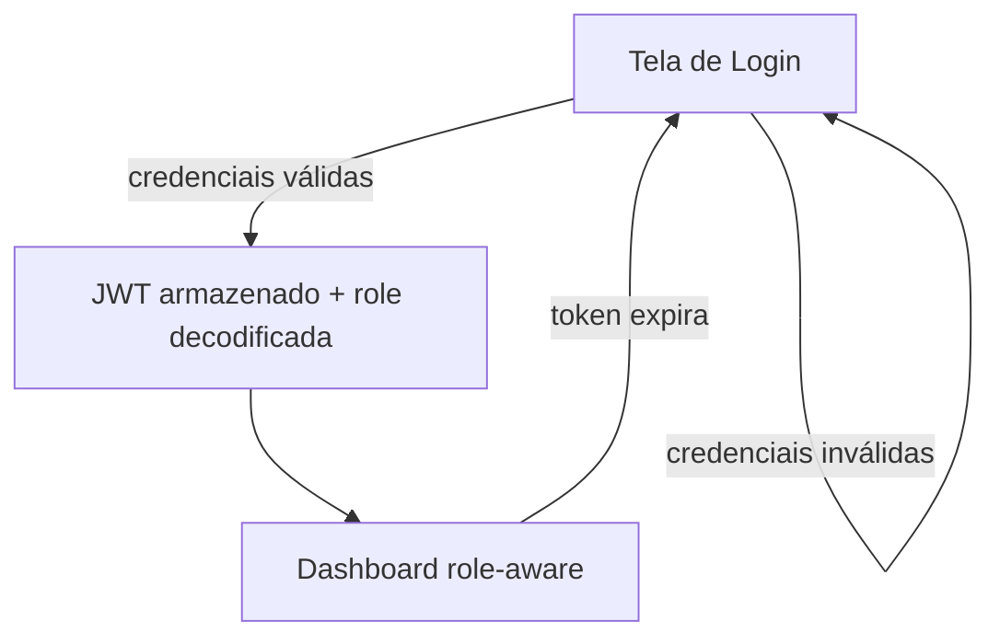
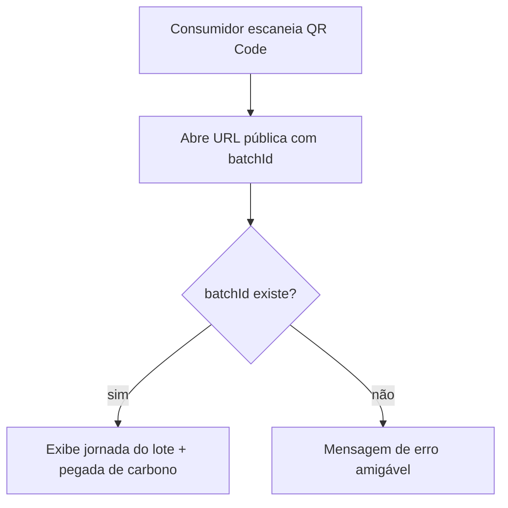
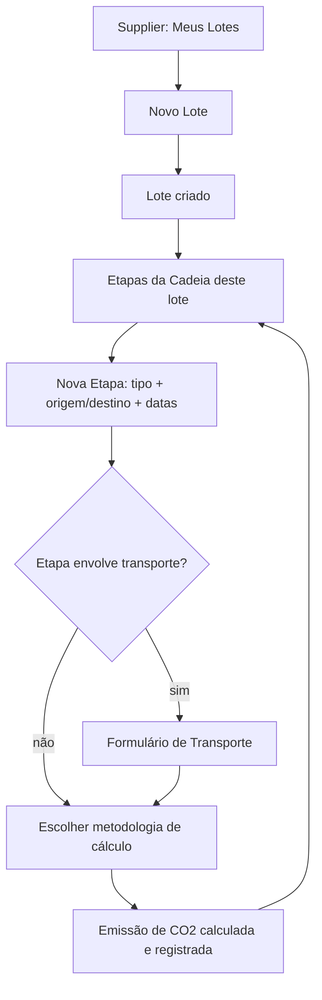

# spec.md — Supply Chain Verde (Frontend)

> Especificação funcional: o quê e por quê, sem detalhe de implementação técnica (isso fica no `plan.md`). Base para as telas do projeto A3 (UC: Banco de Dados, Anhembi Morumbi).

---

## 1. Contexto

O backend (`supply-chain-verde-api`) já expõe a API completa de rastreabilidade de cadeias de suprimento sustentáveis. Este documento define a camada de apresentação: quais telas existem, quem as acessa, e o que cada uma precisa fazer — atendendo ao entregável "Proposta de Arquitetura de Dados" (frontend) do edital, e servindo de roteiro pra demonstração na apresentação oral.

---

## 2. Perfis de Usuário

| Perfil | Quem é | Acesso |
|---|---|---|
| **Público** | Qualquer pessoa (consumidor escaneando QR Code) | Sem login |
| **admin** | Administrador do sistema | Total |
| **manager** | Gestor — cadastra fornecedores/produtos, gera relatórios | Amplo, sem gestão de usuários |
| **auditor** | Valida certificações, consulta relatórios e auditoria | Leitura + validação |
| **supplier** | Fornecedor — gerencia seus próprios lotes e certificações | Restrito aos próprios dados |

---

## 3. Telas e User Stories

### 3.1 Pública (sem login)

#### Rastreabilidade do Lote
> Como consumidor, quero escanear o QR Code de um produto para ver sua jornada completa, para confiar na origem sustentável do que estou comprando.

**Critérios de aceitação:**
- Acessível via `batchId` na URL, sem autenticação.
- Mostra: produto, fornecedor, linha do tempo das etapas (`Chain`), endereços de origem/destino por etapa, meio de transporte usado, e pegada de carbono total + por etapa.
- Se o `batchId` não existir, mostra mensagem de erro amigável (não expõe detalhe técnico).

---

### 3.2 Autenticação (todos os perfis)

#### Login
> Como usuário do sistema, quero entrar com email e senha, para acessar as funcionalidades do meu perfil.

**Critérios de aceitação:**
- Formulário com email/senha, chama `POST /auth/login`.
- Erro de credencial inválida exibido de forma clara, sem detalhar se foi o email ou a senha (segurança).
- Login bem-sucedido redireciona para o Dashboard.
- Sessão expira quando o JWT expira; usuário é redirecionado ao Login (sem refresh token, conforme decisão registrada no backend).

#### Dashboard
> Como usuário autenticado, quero ver um resumo relevante ao meu perfil assim que entro, para saber rapidamente o que fazer em seguida.

**Critérios de aceitação:**
- Conteúdo varia por `role` (ex: supplier vê seus lotes recentes; auditor vê certificações expirando; manager vê ranking de fornecedores).

---

### 3.3 Admin

#### Gestão de Usuários
> Como admin, quero cadastrar usuários e definir seu perfil de acesso, para controlar quem usa o sistema e com que permissão.

**Critérios de aceitação:**
- Lista de usuários com `role` visível.
- Formulário de criação (`POST /users`).
- Ação de alterar `role` de um usuário existente (`PATCH /users/{id}/role`).

#### Auditoria do Sistema
> Como admin, quero consultar o histórico de ações realizadas no sistema, para investigar qualquer inconsistência.

**Critérios de aceitação:**
- Lista somente leitura de `AuditLog` (`GET /audit-logs`), com filtro por usuário/ação/tabela afetada.

---

### 3.4 Manager

#### Fornecedores
> Como manager, quero cadastrar e editar fornecedores, para manter a base de parceiros da cadeia atualizada.

**Critérios de aceitação:**
- Lista de fornecedores com busca.
- Formulário de cadastro/edição, incluindo endereço.

#### Ranking de Fornecedores
> Como manager, quero ver os fornecedores ranqueados por desempenho ambiental, para decidir com quem priorizar parceria.

**Critérios de aceitação:**
- Lista ordenável por score de sustentabilidade, nº de certificações ativas, e CO₂ total (`GET /suppliers/ranking`).

#### Produtos
> Como manager, quero cadastrar os produtos que a cadeia rastreia, para que cada lote possa ser vinculado a um produto conhecido.

**Critérios de aceitação:**
- Lista + formulário de cadastro/edição, com `category` e `unit` como `<select>` (refletindo os ENUMs do backend).

#### Relatórios
> Como manager, quero gerar e consultar relatórios de sustentabilidade por fornecedor e período, para acompanhar a evolução ambiental da cadeia.

**Critérios de aceitação:**
- Formulário de geração (fornecedor + período) → `POST /suppliers/{id}/reports`.
- Lista de relatórios já gerados, com total de CO₂ e produtos rastreados.

---

### 3.5 Auditor

#### Certificações
> Como auditor, quero validar o status das certificações enviadas pelos fornecedores, para garantir que só certificações legítimas fiquem ativas.

**Critérios de aceitação:**
- Lista de certificações com filtro "expirando em breve" (`GET /certifications/expiring`).
- Ação de alterar status (`active`, `expired`, `suspended`, `underReview`) via `PATCH /certifications/{id}/status`.

#### Relatórios (consulta)
> Como auditor, quero consultar os relatórios de sustentabilidade gerados, para validar se os dados sustentam uma certificação externa.

**Critérios de aceitação:**
- Mesma tela de listagem de relatórios do manager, em modo somente leitura para o auditor.

#### Auditoria do Sistema
- Mesma tela do admin (seção 3.3) — auditor também tem acesso, conforme a tabela de rotas.

---

### 3.6 Supplier

#### Meu Perfil
> Como fornecedor, quero ver e atualizar meus dados cadastrais, para manter minhas informações corretas.

**Critérios de aceitação:**
- Exibe dados do próprio `Supplier`; edição via `PUT /suppliers/{id}` (o próprio, não qualquer um).

#### Minhas Certificações
> Como fornecedor, quero cadastrar minhas certificações ambientais, para comprovar práticas sustentáveis.

**Critérios de aceitação:**
- Lista das próprias certificações com status visível.
- Formulário de cadastro (`POST /suppliers/{id}/certifications`) — sem campo de status (definido só pelo auditor).

#### Meus Lotes
> Como fornecedor, quero registrar um novo lote de produto, para iniciar o rastreamento da cadeia.

**Critérios de aceitação:**
- Lista dos próprios lotes.
- Formulário de cadastro (`POST /batches`), vinculando a um `Product` existente.

#### Etapas da Cadeia
> Como fornecedor, quero registrar as etapas pelas quais um lote passa (produção, armazenagem, transporte, distribuição, varejo), para que a rastreabilidade e a pegada de carbono sejam calculadas.

**Critérios de aceitação:**
- Lista de etapas de um lote específico, em ordem cronológica.
- Formulário de nova etapa: tipo, endereço de origem/destino (opcionais), datas de início/fim.
- Se o tipo de etapa envolver transporte, formulário adicional de transporte (modal, distância, combustível) na mesma tela/fluxo.
- Após registrar a etapa (e transporte, se houver), oferece ação explícita para calcular a emissão de carbono daquela etapa (`POST /stages/{id}/emission`) — usuário escolhe a metodologia (`calculationMethod`).

#### Meus Relatórios
> Como fornecedor, quero consultar os relatórios de sustentabilidade gerados sobre minha operação, para acompanhar meu próprio desempenho.

**Critérios de aceitação:**
- Lista somente leitura dos próprios relatórios (`GET /suppliers/{id}/reports`).

---

## 4. Sitemap (Tabela-Resumo)

| Tela | Perfis | Endpoint(s) principal(is) |
|---|---|---|
| Rastreabilidade do Lote | Público | `GET /batches/{id}/traceability`, `GET /batches/{id}/carbon-footprint` |
| Login | Todos | `POST /auth/login` |
| Dashboard | Todos autenticados | varia por perfil |
| Usuários | admin | `POST /users`, `GET /users/me`, `PATCH /users/{id}/role` |
| Auditoria do Sistema | admin, auditor | `GET /audit-logs` |
| Fornecedores | admin, manager | `POST/PUT/GET /suppliers` |
| Ranking de Fornecedores | admin, manager, auditor, supplier | `GET /suppliers/ranking` |
| Produtos | admin, manager | `POST/PUT/GET /products` |
| Relatórios | manager (gerar), auditor (consulta), supplier (próprios) | `POST/GET /suppliers/{id}/reports` |
| Certificações | auditor (validar), supplier (próprias) | `POST /suppliers/{id}/certifications`, `PATCH /certifications/{id}/status`, `GET /certifications/expiring` |
| Meu Perfil (Fornecedor) | supplier | `GET/PUT /suppliers/{id}` |
| Meus Lotes | supplier, admin, manager, auditor (consulta) | `POST /batches`, `GET /suppliers/{id}/batches` |
| Etapas da Cadeia | supplier, manager, admin | `POST/GET /batches/{id}/stages`, `POST /stages/{id}/transport`, `POST /stages/{id}/emission` |

---

## 5. Fluxos Principais

### 5.1 Login → Dashboard

### 5.2 Rastreabilidade Pública (QR Code)

### 5.3 Registro de Lote → Etapa → Emissão (fluxo do Supplier)

---

## 6. Fora de Escopo (MVP)

- Exportação de relatório em PDF/CSV
- Dashboards com múltiplos gráficos elaborados (um gráfico simples de CO₂ por período é suficiente)
- Autocadastro público de fornecedor (cadastro é feito por `admin`/`manager`, não self-service)
- Refresh token / renovação automática de sessão (pendência já registrada no backend)

---

*Próximo documento: `plan.md`, traduzindo esta especificação em arquitetura técnica Angular (módulos, roteamento, estado, e o `CLAUDE.md` do repositório frontend).*
